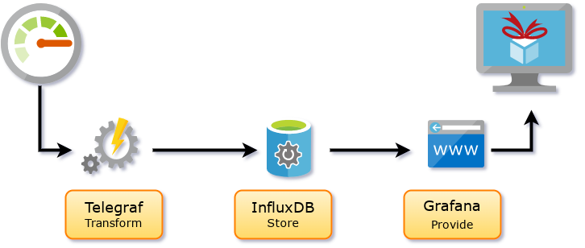
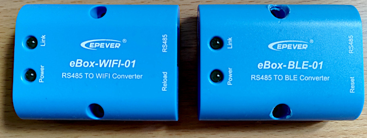
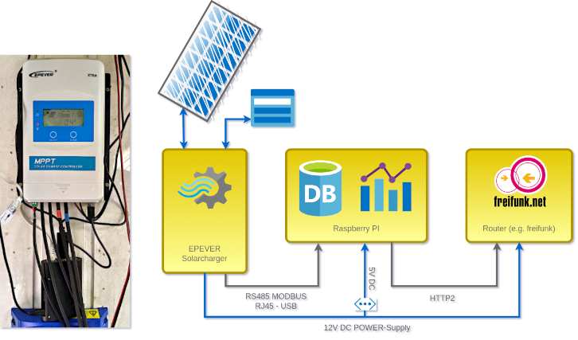

# Getting metrics from the modbus interface of the EPever solar charger

## Abstract

This document gives some instructions for setting up an web based interface to the EPever solar charger XTRA and TRACER series. It should be easily adoptable to other solar chargers if they providing a modbus interface. MODBUS RJ45 to USB adapter also can be replaced with other connection solutions to the Raspberry. The telegraf software which is in task for collecting the data from the charger and send it to the influx data base has a widh range of input module configurations, with well documented examples.

Sketch of data processing through telegraf, influxdb and grafana

One aim for providing this description for setting up a replacement for the EPever Hardware solutions, is to prevent you from buying  some of the EPever's additional hardware like the eBox-WIFI-01 or eBox-BLE-01. In contrast to the solar charger, which is operating well, the eBoxes are both much too expensive for their cheapest interieur and also a reason for great security concerns.

The two eBox types distributed by EPever. Screw holes on the right eBox represent the state of delivery.

So let's start

## Prerequisites

 1. Raspberry Pi 3 or Raspberry Pi 4
 2. RaspianOS **This works with current legacy version (based on debian buster) only, the epsolar-tracer software does not compile with debian bullseye)** 
 3. Modbus Specification for your Solar Charger (if not EPever XTRA, TRACER Series)
 4. MODBUS RJ45 to USB Adapter (likewise CC-USB-RS485-150U PC Communication Cable)
 5. Specification for the MODBUS Adapter
 
### Software for to access, store and provide the metrics:
 
 1. InfluxDB
 2. Telegraf
 3. Grafana
 4. USB-Driver the CC-USB-RS485-150U PC Communication Cable - if used

## Installation

### InfluxDB, telegraf

InfluxDB and telegraf are both open source software under MIT license. The software is released and maintained by influxdata. Both, telegraf and influxDB can be acquired and updated by adding the influx repository to your Raspberry repository manager.

    pi@raspi/> export DISTRIB_ID=debian; export DISTRIB_CODENAME=$(lsb_release -sc)
    pi@raspi/> curl -s https://repos.influxdata.com/influxdb.key | gpg --dearmor > /etc/apt/trusted.gpg.d/influxdb.gpg
    pi@raspi/> echo "deb [signed-by=/etc/apt/trusted.gpg.d/influxdb.gpg] https://repos.influxdata.com/${DISTRIB_ID,,} ${DISTRIB_CODENAME} stable" > /etc/apt/sources.list.d/influxdb.list

Now telegraf and influxDB should be installable and missing dependency should be fixed automatically.

    pi@raspi/> sudo apt update
    pi@raspi/> sudo apt install telegraf
    pi@raspi/> sudo apt install influxdb

### USB-Driver for CC-USB-RS485-150U PC Communication Cable

Since the Communication Cable doesn't work with the default cdc-acm driver we have to replace the this driver. 
Download and install driver for CC-USB-RS485-150U PC Communication Cable.

    git clone https://github.com/kasbert/epsolar-tracer.git

The Kasbert Driver was the only driver I found feasible running with the CC-USB-RS485-150U PC Communication Cable. Unfortunately `make, install` doesn't worked for me. I used the [suggested](https://github.com/kasbert/epsolar-tracer/tree/master/xr_usb_serial_common-1a) alternative way of installation via dkms:

    pi@raspi/> sudo apt install dkms
    pi@raspi/> sudo su
    root@raspi# cp -a ../xr_usb_serial_common-1a /usr/src/
	root@raspi# dkms add -m xr_usb_serial_common -v 1a
	root@raspi# dkms build -m xr_usb_serial_common -v 1a
	root@raspi# dkms install -m xr_usb_serial_common -v 1a

Ensure that the cdc-acm module is not loaded:

	root@raspi# echo blacklist cdc-acm > /etc/modprobe.d/blacklist-cdc-acm.conf 
	root@raspi# update-initramfs -u

#### Testing connection

If driver installation is completed, you should able to find a new device as one of `/dev/ttyXRUSB0, /dev/ttyXRUSB1, /dev/ttyXRUSB2, /dev/ttyXRUSB3`. If device isn't `/dev/ttyXRUSB0` please apply device path accordingly in the telegraf.conf (see below).

Connection can be tested with the console tool `mbpoll`. 
Use the given options for CC-USB-RS485-150U PC Communication Cable for instance.
    
    pi@raspi/> sudo apt install mbpoll
    pi@raspi/> sudo su
    root@raspi# mbpoll -h # to list options 
    root@raspi# mbpoll -m rtu -a 1 -c 1 -t 0 -b 115200 -o 2 -l 3000 -P none /dev/ttyXRUSB0

#### Mind the gap!
If the kernel updated, you have to recompile the module manually in case of a reboot. This can be done with

    pi@raspi/> sudo su
	root@raspi# dkms add -m xr_usb_serial_common -v 1a
	root@raspi# dkms build -m xr_usb_serial_common -v 1a
	root@raspi# dkms install -m xr_usb_serial_common -v 1a

## Configuration

### Start and enable influxdb

    pi@raspi/> sudo systemctl enable influxdb
    pi@raspi/> sudo systemctl start influxdb

Create new database and user in influxdb and grant manipulation to new user

    pi@raspi/> sudo su
    root@raspi# influx
    > CREATE DATABASE pvmetrics;
    > CREATE USER "pvmetrics" WITH PASSWORD '********' WITH ALL PRIVILEGES;
    > exit
    root@raspi# exit

#### Mind the gap!

`exit`-command in influx only works without semikolon!

## Start and enable telegraf

    pi@raspi/> sudo systemctl enable telegraf
    pi@raspi/> sudo systemctl start telegraf

#### Mind the gap!

telegraf runs on its own user telegraf. ;-)  After installation the telegraf user has not sufficiant rights for starting telegraf on system boot. Therefore you HAVE TO put the telegraf user into group dialout via

    pi@raspi/> sudo su
    root@raspi# adduser telegraf dialout
    root@raspi# exit

The telegraf configuration file is located at /etc/telegraf/telegraf.conf. Within the ´section \[\[outputs.influxdb\]\] configure the following lines:

    pi@raspi/> sudo nano /etc/telegraf/telegraf.conf
        
        # Configuration for sending metrics to InfluxDB
        [[outputs.influxdb]]

        database = "pvmetrics"
        ...
        skip_database_creation = true
        ...
        ## HTTP Basic Auth
        username = "pvmetrics"
        password = "************"

You can configure the modbus input within the telegraf.conf. A better way to use the modular plugin based structure of telegraf is to provide a configuration file for each input in the /etc/telegraf/telegraf.d/ directory.

For instance, copy the file epever.conf provided here into your /etc/telegraf/telegraf.d/ directory.

### RTU Connection

    [[inputs.modbus]]
      ## Connection Configuration
      ##
      ## The plugin supports connections to PLCs via MODBUS/TCP, RTU over TCP, ASCII over TCP or
      ## via serial line communication in binary (RTU) or readable (ASCII) encoding
      ##
      ## Device name
      name = "epever"
      name_override = "_epever"

      ## Slave ID - addresses a MODBUS device on the bus
      ## Range: 0 - 255 [0 = broadcast; 248 - 255 = reserved]
      slave_id = 1

      ## Timeout for each request
      timeout = "2s"

      ## Maximum number of retries and the time to wait between retries
      ## when a slave-device is busy.
      busy_retries = 5
      busy_retries_wait = "3000ms"

      ...

      ## Serial (RS485; RS232)
      controller = "file:///dev/ttyXRUSB0"
      baud_rate = 115200
      data_bits = 8
      parity = "N"
      stop_bits = 1

      ## For Modbus over TCP you can choose between "TCP", "RTUoverTCP" and "ASCIIoverTCP"
      ## default behaviour is "TCP" if the controller is TCP
      ## For Serial you can choose between "RTU" and "ASCII"
      transmission_mode = "RTU"

#### Mind the gap!

Be aware, the correct connection data MUST be provided for some of the MODBUS RJ45 to USB Adapters (especially the "CC-USB-RS485-150U PC Communication Cable"). As an low power item the cable need 2 seconds timeout for instance.

### Check the telegraf configuration without writing something into influxdb

Tp prevent you from writing wrong data to influxdb you can check the configuration result with:

    pi@raspi/> sudo su
    root@raspi# telegraf -config /etc/telegraf/telegraf.d/xtra.conf -test -debug

You will get an text output to stdout which lists the transformed results from modbus, if running either.

## Sources

1. [https://www.secretisland.de/raspberry-pi-als-powermeter/](https://www.secretisland.de/raspberry-pi-als-powermeter/)
2. [https://github.com/kasbert/epsolar-tracer/tree/master/xr_usb_serial_common-1a](https://github.com/kasbert/epsolar-tracer/tree/master/xr_usb_serial_common-1a)
3. [https://www.bjoerns-techblog.de/2017/05/installation-von-influxdb-telegraf-und-grafana-auf-dem-raspberry-pi-3/](https://www.bjoerns-techblog.de/2017/05/installation-von-influxdb-telegraf-und-grafana-auf-dem-raspberry-pi-3/)
4. [https://forums.opensuse.org/showthread.php/531256-How-to-access-USB-Serial-devices](https://forums.opensuse.org/showthread.php/531256-How-to-access-USB-Serial-devices)

